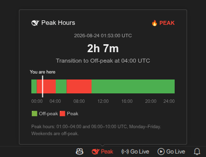

# Deep Peak Hours Tracker

> **Disclaimer:** This extension is an independent, open‑source project created by a community developer. It is **not affiliated with, endorsed by, or sponsored by DeepSeek** or its parent company.

**Track DeepSeek API peak/off‑peak hours directly in your VS Code status bar** – reduce costs, avoid throttling, and optimize your workflow by running non‑urgent tasks during lower‑cost periods.

> 💡 **No API Key, No Internet** – works entirely offline using UTC time.

  
   
  Real-time status hover preview in Dark Theme

## Why This Extension Matters

DeepSeek API uses **peak/off‑peak pricing** to manage resource allocation efficiently. During peak hours, prices are **2×** the regular rate across all billing items. Off‑peak rates are **half** of peak rates, making it significantly cheaper to run inference during low‑traffic periods.

Being aware of when peak hours occur helps you:

- **Reduce costs** – schedule non‑urgent batch jobs during off‑peak hours
- **Avoid throttling** – peak periods may experience higher latency and stricter rate limits
- **Plan development** – align your API usage with cost‑effective time windows

> **DeepSeek pricing details:** [DeepSeek API Models & Pricing](https://api-docs.deepseek.com/quick_start/pricing/)

## Peak Hours Schedule

| Time Zone | Peak Hours | 
| :--- | :--- |
| **UTC** | 01:00–04:00 and 06:00–10:00 |

**Weekends** (Saturday & Sunday) are entirely off-peak.  
All other hours outside are off-peak.  

> **Source:** [DeepSeek API Models & Pricing - footnote (1)](https://api-docs.deepseek.com/quick_start/pricing/)

## How It Works

This extension **does not require a DeepSeek API key** and **never makes network requests**. It simply reads the current UTC time and compares it against DeepSeek's official peak‑hour schedule. All logic runs locally on your machine – no data is collected, sent, or stored.

## Features

- **Real‑time status** - displays Peak / Peak soon / Off‑peak soon / Off‑peak in the VS Code status bar

- **Color‑coded alerts**:
  - 🔴 **Peak** - Peak hours (higher cost, higher latency)
  - 🟡 **Buffer / soon** - Transition period (Peak soon or off‑peak soon)
  - 🟢 **Off‑peak** - lower cost, better performance

- **Hover preview** - hover over the status bar item to see a detailed dashboard with a countdown timer, timeline, and impact forecast.
- **Smart refresh** - updates every 5 minutes normally, and every **30 seconds** near scheduled transitions
- **Transition notifications** - optionally show a notification when the peak-hours status changes

## Configuration

| Setting | Type | Default | Description |
| :--- | :--- | :--- | :--- |
| `deep-peak-hours-tracker.notifications` | boolean | `true` | Show notifications when the peak-hours status changes |
| `deep-peak-hours-tracker.peakSoonMinutes` | number | `5` | Minutes before peak starts to show "Peak soon" status |
| `deep-peak-hours-tracker.peakTransitionBufferMinutes` | number | `1` | Buffer zone length at peak boundaries |
| `deep-peak-hours-tracker.postPeakMinutes` | number | `5` | Minutes after peak ends to show "Off‑peak soon" |

## Data & Privacy

This extension:

- ❌ Does **not** collect any usage data, telemetry, or personal information
- ❌ Does **not** make any network requests – works entirely offline
- ❌ Does **not** require any API keys, tokens, or credentials
- ❌ Does **not** read or write files outside its own packaged resources
- ✅ Only uses the current UTC time to determine peak/off‑peak status

## Disclaimer

This extension is **not affiliated with, endorsed by, or sponsored by DeepSeek**. It is an independent, open‑source tool created by a community developer to help users track peak/off‑peak hours based on publicly available information.

All product names, logos, and brands are property of their respective owners. Use of the DeepSeek name is for identification purposes only and does not imply any association with DeepSeek.

This tool is provided "as is" for informational purposes only. Always refer to the official DeepSeek documentation for the most accurate and up‑to‑date pricing and peak‑hour schedules.

For official information, please refer to the [DeepSeek API Documentation](https://api-docs.deepseek.com/).
